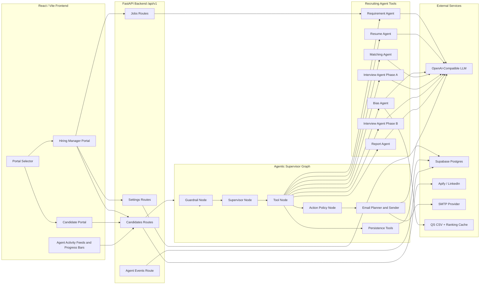
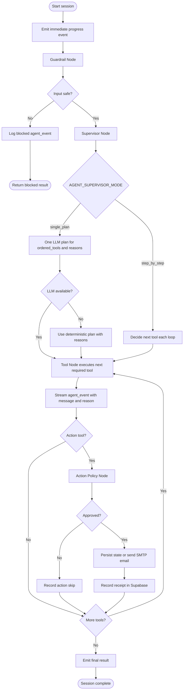
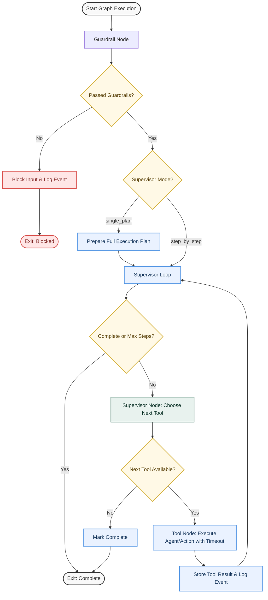

# 404Hire - Agentic Recruiting Workspace

**Group:** 404 Brain Not Found  
**Affiliation:** UTM KL Faculty of AI Students  
**Event:** APU AI Marathon 2026: LLM Everywhere  
**Track:** Problem Statement 2 - The Intelligent Recruiter  

<div align="center">
  
  <p>
    <b>404 Brain Not Found. Talent Found. 👾</b><br>
    <i>Because Great Talent Shouldn’t Be "Not Found."</i>
    <br><br>
    <a href="https://404hire.vercel.app/"><strong>Live Demo Portal</strong></a>
  </p>
</div>

---

## Highlights

* **Agentic Execution Graph**: Operates a state machine supervisor model with dynamic step-by-step planning and deterministic fallback routes.
* **Bounded Autonomy & Safety Policy**: Uses real-time guardrail screening (prompt injection, class-action checks) and SMTP action verification before executing candidate updates.
* **Supabase Runtime Persistence**: Relies on a Supabase Postgres instance to store job configurations, candidate profiles, application statuses, email receipts, and agent events.
* **Explainable Fair Hiring**: Includes blind merit scoring, prestige neutralization (neutralizing Ivy League/FAANG pedigree signals), name anonymization, and institutional fairness audits.
* **Streaming Progress Console**: Uses Server-Sent Events (SSE) to stream live agent steps and logs directly to candidate sandbox views and recruitment dashboards.
* **Intelligent LinkedIn Sourcing**: Sourced talent profiles can be parsed via an automated Apify search scraper or populated using simulated sandbox talent comparisons.
* **Targeted Screening & Evaluation**: The Interview Agent dynamically creates three job-aligned questions and scores candidate answers against strict correctness and evidence-based rubrics.

---

## Tech Stack

| Layer | Technology |
| --- | --- |
| **Frontend** | React 18, Vite 6, TypeScript, React Router, Tailwind CSS, Radix UI, Lucide icons, Recharts, Sonner |
| **Backend** | FastAPI, Pydantic, Uvicorn |
| **Agent Engine** | OpenAI-compatible chat completions, LangGraph dependency, custom evented supervisor graph |
| **Persistence** | Supabase Postgres with RLS service-role security policies |
| **Integrations** | OpenAI API / custom LLM endpoints, Apify Client, SMTP Mailer, 2026 QS Rankings Database |
| **File Extraction** | pypdf, PyMuPDF, pdfminer, Pillow, Tesseract/RapidOCR fallback |

---

## Repository Structure

```text
.
|-- backend/
|   |-- app/
|   |   |-- routes/                 # FastAPI HTTP endpoint routers
|   |   |-- services/
|   |   |   |-- agents/             # Recruiting Agent tools, Supervisor graph, Guardrails
|   |   |   |-- mailer.py           # SMTP mail client and verification
|   |   |   |-- linkedin_profiles.py# Live LinkedIn scraper utility
|   |   |   |-- bias_settings.py    # Fair hiring settings managers
|   |   |   `-- job_windows.py      # Position window validators
|   |   |-- config.py               # Pydantic environment configurations
|   |   `-- database.py             # Supabase repository connector
|   |-- tests/                      # Pytest backend test suites
|   |-- supabase_schema.sql         # Supabase database initialization tables
|   |-- requirements.txt            # Python dependencies
|   `-- main.py                     # Uvicorn FastAPI startup script
|-- src/
|   |-- app/
|   |   |-- components/
|   |   |   |-- candidate/          # Candidate views, sandbox, and verification
|   |   |   |-- hiring-manager/     # HR dashboard, sourcing, and bias control
|   |   |   `-- ui/                 # Reusable layout and custom widgets
|   |   |-- api.ts                  # Axios API configuration
|   |   `-- App.tsx                 # Route declarations
|   |-- assets/
|   `-- styles/
|-- package.json                    # Node dependencies & project scripts
|-- vite.config.ts                  # Vite build configs
`-- README.md                       # Repository documentation
```

---

## System Architecture



---

## Agentic Flow & Supervisor Graph

Rather than executing tools sequentially, 404Hire utilizes an event-driven `RecruitingAgentGraph` state machine to coordinate tasks. The execution pipeline evaluates input safety, generates structured plans, coordinates LLM agents, and enforces action policies.

### Session Lifecycle Flow


### Supervisor State Machine


---

## Recruiting Agent Toolbelt

| Agent Tool | File Location | Purpose & Orchestrated Output |
| --- | --- | --- |
| **Requirement Agent** | `requirement_agent.py` | Receives loose job titles and hiring manager chat to build full role requirements, behavior signals, search queries, and evaluation criteria. |
| **Resume Agent** | `resume_agent.py` | Extracts unstructured PDF/OCR resume strings into standardized JSON schema fields, providing data integrity verification. |
| **Bias Agent** | `bias_agent.py` | Audits candidate data for prestige brand indicators (e.g. elite universities, FAANG employers), neutralizes profile text, and runs prestige rankings lookup. |
| **Matching Agent** | `matching_agent.py` | Scores position alignment using dynamic weights (must-have skills, context matching, growth potential), providing debate logs and score calculators. |
| **Interview Agent (Phase A)** | `interview_agent.py` | Reviews candidate matching gaps and role requirements to generate exactly 3 targeted screening questions. |
| **Interview Agent (Phase B)** | `interview_agent.py` | Critiques screening submissions and rates answers on a role-alignment rubric, producing upskilling roadmap suggestions. |
| **Report Agent** | `report_agent.py` | Synthesizes staged evaluation metrics to draft personalized sourcing pitches, outreach emails, and feedback reports. |

---

## Guardrails & Bounded Autonomy

The architecture enforces a strict distinction between **agent intelligence** and **system authorization**:

* **Safety Guardrails (`guardrails.py`)**: Before tool execution, text payloads are inspected via regular expression filters for:
  * *Prompt Injections*: Attempts to bypass system prompts or force immediate hiring statuses.
  * *Unauthorized System Actions*: Requests to purge tables, leak candidate records, or access other applicants' profiles.
  * *Protected Class Discrimination*: Prompts filtering by race, religion, gender, age, disability, or country of origin.
* **Bounded Autonomy Policies**: Updates to database states and SMTP email dispatches are verified at runtime:
  * *Candidate Outreach*: Email invitations require an overall fit score at or above `AGENT_INVITE_MIN_FIT_SCORE` (default `75`). Rejections require a score below `AGENT_REJECT_MAX_SCREENING_SCORE` (default `45`) and an explicit "reject" recommendation.
  * *Operational Limits*: Actions such as interview scheduling are locked against autonomous execution, requiring recruiter confirmation.
  * *Auditing*: Every blocked event, decision reason, or message receipt is archived to Supabase `agent_events`.

---

## Database Schema (Supabase)

Runtime storage relies entirely on a Supabase PostgreSQL instance. Ensure tables are populated via [backend/supabase_schema.sql](file:///c:/Users/Acer/Desktop/APU/404-Brain-Not-Found-Recruiter/backend/supabase_schema.sql):

* `positions`: Job title, department, requirements, date range limits, active state.
* `candidates`: Standardized parsed profile schemas, credentials, and settings.
* `applications`: Linkages between candidates and positions containing fit scores, screening evaluations, and roadmaps.
* `agent_events`: Detailed logs of supervisor steps, tool outputs, and guardrail alerts.
* `agent_actions` & `email_events`: Receipts of autonomous emails, verification attempts, and state updates.
* `institution_ranking_cache`: Local cache for university QS ranks.

---

## Local Setup & Run Instructions

### Prerequisites
* Node.js 20 or newer
* npm 10 or newer
* Python 3.10 or newer with pip
* A Supabase Postgres Database

### 1. Repository Installation
Clone the repository and install the Node dependency packages:
```bash
npm install
```

Install the backend Python virtual environment and dependencies:
```bash
cd backend
python -m venv .venv
# On Windows:
.venv\Scripts\activate
# On Linux/macOS:
source .venv/bin/activate
pip install -r requirements.txt
```

### 2. Configure Environment Configurations
Copy the environment template file:
```bash
cp backend/.env.example backend/.env
```
Open `backend/.env` and supply your database keys and provider values:
```env
# Required Server & Database Configurations
HOST=0.0.0.0
PORT=8000
SECRET_KEY=use_a_long_random_string_in_production
SUPABASE_URL=https://your-project.supabase.co
SUPABASE_SERVICE_ROLE_KEY=your_supabase_service_role_key

# OpenAI-Compatible LLM Integrations
OPENAI_API_KEY=your_llm_api_key
OPENAI_BASE_URL=https://api.openai.com/v1
OPENAI_MODEL=gpt-4o-mini

# Optional Automations (Apify & SMTP)
SMTP_HOST=smtp.gmail.com
SMTP_PORT=587
SMTP_USER=your_sending_email@gmail.com
SMTP_PASSWORD=your_sending_app_password
APIFY_API_TOKEN=your_apify_api_token
```

### 3. Database Initialization
Open the SQL Editor in your Supabase Project Console. Paste and run the contents of `backend/supabase_schema.sql` to initialize your database structure.

### 4. Execute Locally
Run the FastAPI backend server:
```bash
# From the backend/ folder with virtual environment activated:
uvicorn main:app --host 0.0.0.0 --port 8000 --reload
```
Run the React Vite dev server:
```bash
# In a separate terminal at the project root:
npm run dev
```
Open your browser to `http://localhost:5173/` to explore the workspace.

---

## Demo Credentials

You can sign in to the Hiring Manager Portal directly using these pre-seeded demo accounts:
* **Email**: `admin@company.com` | **Password**: `password`
* **Email**: `hiring@company.com` | **Password**: `password`

---

## Verification & Testing

Verify code compilation and run unit tests to confirm system integrity:
```bash
# Compile check Python files
python -m compileall backend/app backend/tests
# Execute the Pytest suite
pytest backend/tests
# Run Vite production build check
npm run build
```

---

## Troubleshooting Guide

| Symptom / Error | Common Cause | Recommended Fix |
| --- | --- | --- |
| **Supabase RLS/Permission Errors** | Backend using `anon/public` key. | Use the service role secret (`SUPABASE_SERVICE_ROLE_KEY`) to bypass row limits. |
| **LLM / Resume Parsing Timeouts** | LLM provider or base URL is slow/unreachable. | Set `AGENT_SUPERVISOR_MODE=single_plan`, lower `AGENT_WORKER_TIMEOUT_SECONDS`, or switch to a faster model. |
| **Verification / Invite Emails Not Sent** | SMTP credentials missing or invalid. | Confirm integration statuses at `GET /api/v1/settings/integrations/status` and test using the SMTP test endpoint. |
| **LinkedIn Search Returns Simulated Profiles** | `APIFY_API_TOKEN` is blank or actor IDs are incorrect. | Verify token and actor values in `.env`. The system defaults to simulated matching for demos. |
| **No QS Badges / Rankings Displayed** | Institution mismatch or cache missing. | Verify school spelling matches the QS rankings file. Modify cache rows directly in `institution_ranking_cache`. |
