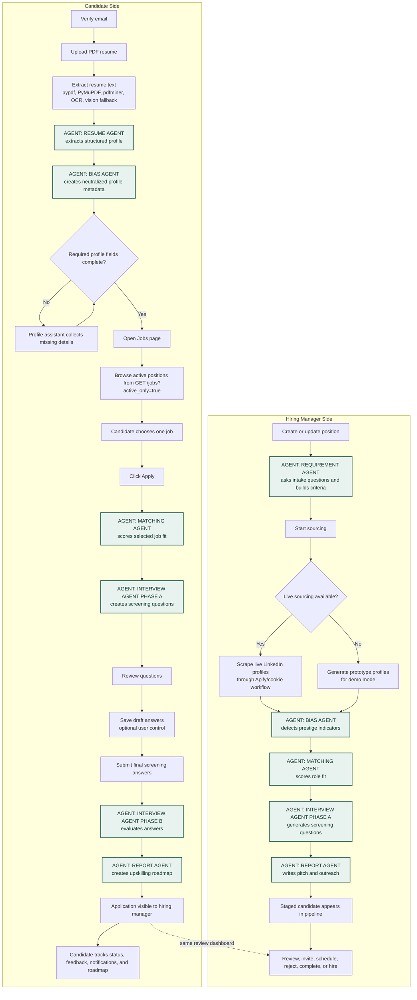
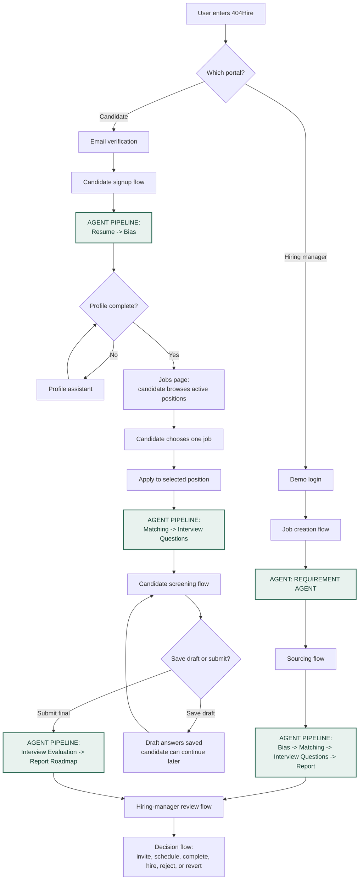
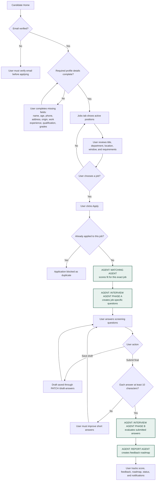
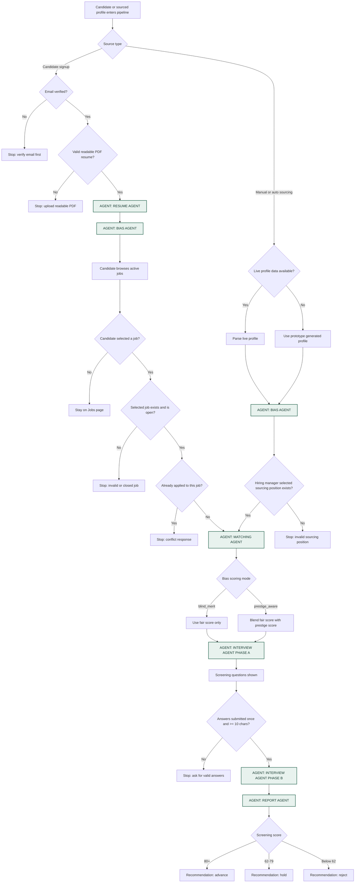

# 404Hire -  Recruitment Workspace

**Group:** 404 Brain Not Found  
**Affiliation:** UTM KL Faculty of AI students  
**Event:** APU AI Marathon 2026: LLM Everywhere  
**Track:** Problem Statement 2 - The Intelligent Recruiter  

<div align="center">
  
  <p>
  <b><h3>404 Brain Not Found. Talent Found. 👾<br>
  Because Great Talent Shouldn’t Be "Not Found."</b></h3>
  <br>
    <a href="https://404hire.vercel.app/"><strong>Live Demo</strong></a>
  </p>
</div>

404Hire is our AI-powered recruiter workspace for making hiring feel a little less like sorting spreadsheets and a little more like finding real people with real potential. It connects hiring managers and candidates through agentic job intake, resume understanding, candidate matching, screening, outreach, and fair-hiring controls.

The project was built by **404 Brain Not Found**, a team of **UTM KL Faculty of AI students**, for **APU AI Marathon 2026: LLM Everywhere**. The idea is simple: give a hiring manager a role, give the system candidate data, and let the agents help explain who looks promising, why they look promising, what risks to verify, and how to move the process forward fairly.

## Table Of Contents

- [Live Deployment](#live-deployment)
- [Marathon Alignment](#marathon-alignment)
- [Project Overview](#project-overview)
- [Core Features](#core-features)
- [AI Agent Workflow](#ai-agent-workflow)
- [Process Flow](#process-flow)
- [Decision Logic](#decision-logic)
- [System Architecture](#system-architecture)
- [Tech Stack](#tech-stack)
- [Project Structure](#project-structure)
- [Local Setup](#local-setup)
- [Environment Variables](#environment-variables)
- [Demo Accounts](#demo-accounts)
- [API Reference](#api-reference)
- [Data And Storage](#data-and-storage)
- [Validation And Safety](#validation-and-safety)
- [Troubleshooting](#troubleshooting)
- [Production Notes](#production-notes)
- [Verification Checklist](#verification-checklist)

## Live Deployment

| Service | Platform | URL | Purpose |
| --- | --- | --- | --- |
| Frontend website | Vercel | [https://404hire.vercel.app](https://404hire.vercel.app) | Hosts the React/Vite web application and serves the public user interface. |
| Backend API | Railway | `https://<your-railway-service>.up.railway.app` | Runs the FastAPI backend and exposes the API over HTTPS using `backend/railway.json`. |

The frontend lives on **Vercel** because it is a comfortable fit for Vite builds, preview deployments, and fast static asset delivery.

The backend lives on **Railway** because it can run the Python FastAPI service directly from the repo with Railpack. This project does not require Docker for backend hosting; Railway reads `backend/railway.json`, detects `backend/requirements.txt`, installs the Python dependencies, and starts Uvicorn with Railway's `$PORT`.

Production frontend environment variable:

```env
VITE_API_URL=https://<your-railway-service>.up.railway.app/api/v1
```

## Marathon Alignment

APU AI Marathon 2026 is themed **LLM Everywhere**, so the focus is practical: use LLMs where they actually help, connect them to tools, and ship a working prototype people can try.

404Hire addresses the **Intelligent Recruiter** track:

- **Problem:** Traditional job boards are static and do not actively bridge hiring managers with diverse candidate profiles.
- **Mission:** Use candidate data from resumes, profiles, and sourced talent pools to identify strong matches for a job description.
- **Agentic twist:** Go beyond ranking. Generate recruiter explanations, personalized sourcing pitches, screening questions, outreach emails, and fair-hiring analysis.
- **Prototype focus:** Demonstrate an end-to-end recruiter workflow with real LLM calls when configured and deterministic fallback logic when APIs are unavailable.

## Project Overview

404Hire has two connected portals: one for the hiring manager, and one for the candidate. Both sides share the same pipeline, but each gets an experience built around what they need to do next.

### Hiring Manager Portal

Hiring managers can:

- Create and manage job positions.
- Use an adaptive Requirement Agent for job intake.
- Source candidates automatically through live Apify/LinkedIn integration when configured.
- Fall back to prototype candidate sourcing for demos.
- Review candidate match scores, evidence, risks, screening answers, and status.
- Toggle fair-hiring controls such as blind merit scoring, prestige neutralization, anonymized review, and reputation-aware scoring.
- Run a fairness audit over candidate outcomes.
- Schedule interviews, reject candidates, complete reviews, and mark hires.

### Candidate Portal

Candidates can:

- Verify email before account creation.
- Upload a PDF resume.
- Let the Resume Agent extract profile details.
- Complete missing required profile fields with the profile assistant.
- Apply to open positions.
- Answer AI-generated screening questions.
- Review feedback, score breakdowns, and upskilling guidance.
- Receive notifications about application progress.

## Core Features

- Dual-portal React/Vite application for hiring managers and candidates.
- FastAPI backend under `/api/v1`.
- LLM-compatible agent layer using an OpenAI-style chat completions client.
- Adaptive job intake and role requirement generation.
- Resume parsing with LLM extraction, PDF text extraction, OCR fallbacks, and rule-based fallback parsing.
- Candidate profile completion and verification.
- Position windows with open and close dates.
- Manual LinkedIn profile scraping when live scraper credentials are configured.
- Automatic candidate sourcing through Apify or prototype simulation.
- Streaming sourcing progress through Server-Sent Events.
- Position-specific matching with explainable score contributors.
- Interview Agent Phase A question generation and Phase B answer evaluation.
- Candidate upskilling roadmap generation.
- Bias Agent for prestige indicator detection and profile neutralization.
- Bias controls for blind merit, anonymized hiring, and prestige-aware comparison.
- Fairness audit for prestige-related outcome patterns.
- Candidate account administration.
- Interview calendar.
- SMTP verification and optional email notifications.
- Local JSON data store for fast hackathon iteration.

## AI Agent Workflow

404Hire uses six named agents, with the Interview Agent implemented as two executable phases: **5A** generates targeted screening questions and **5B** evaluates submitted answers. Think of them as a small hiring desk: one agent shapes the job, one reads resumes, one checks bias signals, one scores fit, one handles screening, and one writes the human-readable reports.

```mermaid
flowchart LR
    HM["HIRING MANAGER SIDE"] --> RQ["AGENT 1: REQUIREMENT AGENT"]
    RQ --> JOB["Structured job profile"]
    JOB --> SRC{"Source path"}
    SRC -->|Live configured| LIVE["Apify or LinkedIn profile data"]
    SRC -->|No live token| MOCK["Prototype candidate profiles"]
    LIVE --> BA1["AGENT 3: BIAS AGENT"]
    MOCK --> BA1
    BA1 --> MA1["AGENT 4: MATCHING AGENT"]
    MA1 --> IA1["AGENT 5A: INTERVIEW AGENT QUESTIONS"]
    IA1 --> RA1["AGENT 6: REPORT AGENT"]
    RA1 --> STAGED["Staged candidate for review"]

    CAND["CANDIDATE SIDE"] --> PDF["Email verification and PDF resume"]
    PDF --> RES["AGENT 2: RESUME AGENT"]
    RES --> BA2["AGENT 3: BIAS AGENT"]
    BA2 --> PROFILE{"Profile complete?"}
    PROFILE -->|No| ASSIST["Profile assistant collects missing fields"]
    ASSIST --> PROFILE
    PROFILE -->|Yes| JOBS["Candidate browses active jobs"]
    JOBS --> CHOOSE["Candidate chooses one job to apply"]
    CHOOSE --> APPLY["Apply to selected position"]
    APPLY --> MA2["AGENT 4: MATCHING AGENT"]
    MA2 --> IA2["AGENT 5A: INTERVIEW AGENT QUESTIONS"]
    IA2 --> ANSWERS["Candidate submits answers"]
    ANSWERS --> IA3["AGENT 5B: INTERVIEW AGENT EVALUATION"]
    IA3 --> RA2["AGENT 6: REPORT AGENT"]
    RA2 --> REVIEW["Hiring manager review"]

    classDef agent fill:#e8f2ee,stroke:#2d6a55,stroke-width:2px,color:#12382d;
    class RQ,RES,BA1,BA2,MA1,MA2,IA1,IA2,IA3,RA1,RA2 agent;
```



Each agent has a focused responsibility and a fallback path so the demo remains usable even when an external LLM or scraping service is unavailable.

| Agent | File | Input | Output | Role |
| --- | --- | --- | --- | --- |
| Requirement Agent | `backend/app/services/agents/requirement_agent.py` | Job title, department, hiring-manager intake | Job description, requirements, role family, pillars, behavioral signals, Boolean query | Turns a loose hiring request into structured recruiting criteria. |
| Resume Agent | `backend/app/services/agents/resume_agent.py` | Resume text extracted from PDF/OCR | Candidate profile fields, skills, education, experience, summary | Converts unstructured resumes into searchable candidate data. |
| Bias Agent | `backend/app/services/agents/bias_agent.py` | Candidate profile and resume text | Prestige indicators, neutralized profile, reputation score | Detects school/company pedigree signals and supports fair-hiring controls. |
| Matching Agent | `backend/app/services/agents/matching_agent.py` | Job requirements, candidate profile, bias controls | Position-fit score, score contributors, advocate and critical recruiter views | Scores fit using role evidence, domain context, success signals, and trajectory. |
| Interview Agent Phase A | `backend/app/services/agents/interview_agent.py` | Candidate profile, match results, job requirements | Exactly 3 targeted screening questions | Creates position-specific screening questions from the current job and matching concerns. |
| Interview Agent Phase B | `backend/app/services/agents/interview_agent.py` | Screening questions, candidate answers, job requirements | Answer critiques, score breakdown, screening score, verdict, recommendation | Evaluates submitted answers against the selected position using the role-alignment rubric. |
| Report Agent | `backend/app/services/agents/report_agent.py` | Candidate profile, match results, job requirements | Sourcing pitch, outreach email, upskilling roadmap | Produces human-readable recruiter and candidate artifacts. |

### Two-Sided Agent Orchestration



## Process Flow



### Candidate User Control Flow



### 1. Job Creation Flow

1. Hiring manager enters title, department, address, active status, and application window.
2. Requirement Agent asks adaptive follow-up questions.
3. The manager reviews generated description, requirements, sourcing criteria, Boolean query, pillars, and behavioral signals.
4. The backend validates the application window before saving the position.
5. Saved jobs become available through `GET /jobs` and active jobs through `GET /jobs?active_only=true`.

### 2. Candidate Signup Flow

1. Candidate starts email verification.
2. Backend creates a verification code and either sends it through SMTP or exposes it in prototype mode.
3. Candidate verifies the pending email.
4. Candidate submits name, password, and PDF resume.
5. Backend extracts resume text, validates that the resume is readable, runs Resume Agent, saves the PDF, and creates the candidate account.
6. If required fields are missing, the Candidate Portal guides the user through completion before application.

### 3. Candidate Application Flow

1. Candidate opens the Jobs page after email and profile checks pass.
2. Frontend loads active jobs through `GET /jobs?active_only=true`.
3. Candidate reviews the available positions and chooses one job to apply for.
4. Backend checks the selected position exists, is open, and has not already been applied to by the same candidate.
5. Bias Agent attaches fair-hiring metadata and neutralized profile data.
6. Matching Agent produces a position-fit assessment for that selected job.
7. Interview Agent Phase A generates screening questions for that selected job.
8. Candidate can save draft answers or submit final answers.
9. Interview Agent Phase B evaluates final answers and Report Agent creates an upskilling roadmap.
10. Hiring manager reviews the result in the pipeline while the candidate tracks status and notifications.

### 4. Sourcing Flow

1. Hiring manager selects a position in LinkedIn Sourcing.
2. For manual sourcing, the backend validates and normalizes a LinkedIn profile URL.
3. For automatic sourcing, the backend streams progress through Server-Sent Events.
4. If Apify is configured, the backend searches/scrapes live profile data.
5. If Apify is not configured, the backend generates prototype candidates aligned to the job.
6. Bias analysis, matching, Interview Agent Phase A question generation, and report generation run for each candidate.
7. Candidates are saved as `staged` until the hiring manager sends an invitation.

### 5. Hiring Manager Review Flow

1. Hiring manager filters candidates by position and review state.
2. The dashboard shows score contributors, match debate, screening feedback, prestige/bias controls, and candidate details.
3. Hiring manager may invite, schedule interview, reject, mark completed, mark hired, or revert the latest status change.
4. Notifications and optional SMTP emails are sent for major decisions.

## Decision Logic



### Application Gate Logic

| Decision | Condition | Result |
| --- | --- | --- |
| Email verification | Pending email code must match before signup | Candidate can create an account. |
| Resume upload | File must be PDF, 10MB or smaller, and contain readable resume-like text | Resume Agent can process the profile. |
| Position availability | Position must exist and be open for applications | Candidate can apply. |
| Duplicate application | Candidate cannot apply twice to the same position | Backend returns a conflict response. |
| Screening submission | Answers must be submitted once and each answer must be at least 10 characters | Interview Agent Phase B evaluates answers. |

### Matching Score Logic

The Matching Agent builds a score from role-specific evidence:

```text
overall_position_fit =
  must_have_role_evidence * 45%
+ domain_and_position_context * 25%
+ success_and_working_style * 15%
+ trajectory_and_growth * 15%
```

The score is explainable. Each candidate includes:

- `scores.technical`
- `scores.domain`
- `scores.culture`
- `scores.trajectory_slope`
- `scores.overall_position_fit`
- `score_contributors`
- `fit_breakdown`
- `position_fit_summary`
- `score_explanation`
- `debate.talent_advocate_pros`
- `debate.critical_recruiter_cons`

### Bias And Reputation Logic

404Hire separates merit scoring from reputation scoring.

| Mode | What happens |
| --- | --- |
| `blind_merit` | School and employer reputation are classified for transparency but do not affect the final score. |
| `prestige_aware` | The final score includes a configurable reputation component from 0% to 30%. |
| `neutralize_prestige` | Candidate names and profile text can be shown with pedigree indicators replaced by neutral categories. |
| `anonymized_blind_hiring` | Candidate identity can be hidden in hiring-manager views. |

Prestige-aware formula:

```text
biased_score =
  fair_score * (100 - prestige_weight) / 100
+ prestige_score * prestige_weight / 100
```

The Bias Agent detects indicators such as universities, employers, certifications, and elite programs. It also includes a small QS ranking map for demo comparison, including APU as a recognized university signal.

### Fairness Audit Logic

The fairness audit uses available recruitment outcomes and prestige signals. It does not infer protected classes.

The audit checks:

- Total candidate applications in scope.
- Selection and rejection rates.
- High-prestige versus lower-prestige selection rates.
- Prestige selection gap.
- Whether prestige-aware scoring is active.
- Risk level: `low`, `medium`, `high`, or `insufficient_data`.

### Screening Evaluation Logic

Interview Agent Phase A generates exactly three targeted questions for the current position. Interview Agent Phase B evaluates answers against the actual position, not generic interview quality.

Screening score breakdown:

| Dimension | Max |
| --- | ---: |
| Role requirement alignment | 35 |
| Technical correctness and depth | 25 |
| Evidence specificity | 20 |
| Position impact | 10 |
| Communication clarity | 10 |

Recommendation logic:

| Screening score | Verdict | Recommendation |
| --- | --- | --- |
| 80 or above | Strong fit | Advance |
| 62 to 79 | Moderate fit | Hold |
| Below 62 | Weak fit | Reject |

### Candidate Status Logic

Candidate applications do not follow one single linear path. Inbound applicants usually move from a profile account into an applied application and then screening after answers are submitted. Sourced candidates are staged first and can be invited before later candidate-side activity. The hiring manager can then mark screening as completed, schedule an interview, hire, reject, or revert the latest status change.

```text
Inbound: profile -> applied -> screening -> completed -> interview_scheduled -> hired
Sourced: staged -> invited -> applied -> screening -> completed -> interview_scheduled -> hired

Any active application can be rejected.
```

Supported backend statuses:

```text
profile, staged, invited, applied, screening, completed, hired, inactive, rejected, interview_scheduled
```

Status changes keep a short history so the hiring manager can revert the latest change.

## System Architecture

```text
React/Vite frontend
  |
  | VITE_API_URL
  v
FastAPI backend
  |
  | /api/v1 routes
  v
Route layer
  |
  | orchestrates
  v
Agent services, LinkedIn helpers, mailer, job-window validation, bias controls
  |
  v
Local JSON database and upload folders
```

### Backend Runtime

- `backend/main.py` creates the FastAPI app.
- Routes are registered under `/api/v1`.
- Uploads are served from `/uploads`.
- CORS is currently open for prototype deployment.
- Local database initialization runs at startup.

## Tech Stack

### Frontend

- React 18
- TypeScript
- Vite 6
- Tailwind CSS 4 utility styling
- Radix UI primitives
- Lucide React icons
- Recharts
- Motion
- React Big Calendar
- Sonner toasts

### Backend

- Python
- FastAPI
- Uvicorn
- Pydantic and pydantic-settings
- OpenAI-compatible chat completions client
- pypdf
- pdfminer.six
- PyMuPDF
- Pillow
- pytesseract
- RapidOCR
- Playwright
- Apify Client
- SMTP email support

### Storage

- Local JSON database: `backend/data/recruiting_db.json`
- Uploaded resumes: `backend/uploads/resumes/`
- Extracted profile pictures: `backend/uploads/profile_pictures/`

## Project Structure

```text
.
|-- backend/
|   |-- app/
|   |   |-- config.py
|   |   |-- database.py
|   |   |-- routes/
|   |   |   |-- candidates.py
|   |   |   |-- jobs.py
|   |   |   `-- settings.py
|   |   `-- services/
|   |       |-- agents/
|   |       |-- bias_settings.py
|   |       |-- job_windows.py
|   |       |-- linkedin_profiles.py
|   |       `-- mailer.py
|   |-- data/
|   |-- uploads/
|   |-- main.py
|   `-- requirements.txt
|-- public/
|-- src/
|   |-- app/
|   |   |-- components/
|   |   |   |-- candidate/
|   |   |   `-- hiring-manager/
|   |-- assets/
|   |-- styles/
|   `-- main.tsx
|-- index.html
|-- package.json
|-- vite.config.ts
`-- README.md
```

## Local Setup

You can run everything locally with one backend terminal and one frontend terminal. Nothing fancy, just the usual two-window ritual.

### Prerequisites

- Node.js 20 or newer
- npm 10 or newer
- Python 3.10 or newer
- pip

Optional for scanned or image-only resumes:

- Tesseract OCR executable in `PATH`
- Python OCR dependencies from `backend/requirements.txt`

### Install Dependencies

Install frontend dependencies:

```powershell
npm install
```

For a clean clone or CI install, use the lockfile:

```powershell
npm ci
```

Install backend dependencies:

```powershell
python -m pip install -r backend\requirements.txt
```

If Playwright browser dependencies are needed for authenticated LinkedIn scraping:

```powershell
python -m playwright install
```

### Run Locally

Start the backend:

```powershell
python -m uvicorn main:app --app-dir backend --host 0.0.0.0 --port 8000 --reload
```

Start the frontend:

```powershell
npm run dev
```

Open the Vite URL shown in the terminal, usually:

```text
http://localhost:5173/
```

Check backend health:

```powershell
Invoke-WebRequest http://localhost:8000/ -UseBasicParsing
```

Expected response:

```json
{
  "status": "online",
  "service": "Intelligent Recruiter Workspace API",
  "version": "1.0.0"
}
```

## Environment Variables

### Backend

Create `backend/.env` from the example file:

```powershell
Copy-Item backend\.env.example backend\.env
```

Example backend configuration:

```env
HOST=0.0.0.0
PORT=8000
DEBUG=True
DATABASE_PATH=data/recruiting_db.json

OPENAI_API_KEY=your_openai_api_key_here
OPENAI_BASE_URL=https://api.mor.org/api/v1
OPENAI_MODEL=deepseek-v4-pro

RESUME_AGENT_TEMP=0.1
REQUIREMENT_AGENT_TEMP=0.2
MATCHING_AGENT_TEMP=0.4
INTERVIEW_AGENT_TEMP=0.3
REPORT_AGENT_TEMP=0.3

SMTP_HOST=smtp.gmail.com
SMTP_PORT=587
SMTP_USER=your_email@gmail.com
SMTP_PASSWORD=your_app_specific_password

LINKEDIN_LI_AT_COOKIE=
LINKEDIN_HEADLESS=True

APIFY_API_TOKEN=
APIFY_PROFILE_ACTOR_ID=curious_coder/linkedin-profile-scraper
APIFY_SEARCH_ACTOR_ID=M2FMdjRVeF1HPGFcc
APIFY_TIMEOUT_SECONDS=90
```

Tiny but important reminder: do not commit real API keys, SMTP passwords, cookies, or personal secrets. Future-you will be grateful.

When using live Apify LinkedIn scraping, some actors may require manual approval in the Apify account on first use. If the sourcing console shows a permission error with an approval URL, open the URL in Apify Console and approve the actor permissions.

### Frontend

Create `.env.local` in the project root for local development:

```env
VITE_API_URL=http://localhost:8000/api/v1
```

For production on Vercel:

```env
VITE_API_URL=https://<your-railway-service>.up.railway.app/api/v1
```

### Railway Backend Hosting

The backend is configured for Railway with `backend/railway.json`. No Dockerfile is needed.

1. Create a new Railway project from this GitHub repo.
2. Set the Railway service root directory to `/backend`.
3. Set the Railway config file path to `/backend/railway.json`.
4. Leave Railway's custom Build Command empty. Do not paste local setup commands such as `python -m pip install -r backend\requirements.txt`.
5. Leave Railway's custom Install Command empty unless you have a specific reason to override Railpack.
6. Add the backend environment variables from `backend/.env.example` in Railway Variables.
7. Set `DEBUG=False` for production.
8. Deploy the service.
9. Copy the Railway public domain and set the Vercel frontend variable to:

```env
VITE_API_URL=https://<your-railway-service>.up.railway.app/api/v1
```

Railway uses this start command:

```bash
uvicorn main:app --host 0.0.0.0 --port $PORT
```

## Demo Accounts

Hiring manager demo accounts:

```text
admin@company.com
password
```

```text
hiring@company.com
password
```

Candidate accounts are created through the Candidate Portal, because the candidate flow includes email verification, resume upload, and profile completion.

## API Reference

Local API base URL:

```text
http://localhost:8000/api/v1
```

Production API base URL:

```text
https://<your-railway-service>.up.railway.app/api/v1
```

### Jobs

```text
GET    /jobs
GET    /jobs?active_only=true
POST   /jobs/intake
POST   /jobs
PATCH  /jobs/{job_id}
DELETE /jobs/{job_id}
```

### Settings

```text
POST  /settings/smtp/verify
GET   /settings/bias-controls
PATCH /settings/bias-controls
```

### Candidates And Applications

```text
GET    /candidates
GET    /candidates?neutralize=true
GET    /candidates/fairness-audit
GET    /candidates/fairness-audit?position_id={position_id}
GET    /candidates/lookup?email={email}
POST   /candidates/start-email-verification
POST   /candidates/verify-pending-email
POST   /candidates/signup
POST   /candidates/login
POST   /candidates/{email}/password
POST   /candidates/{email}/reset-password
PATCH  /candidates/{email}/account
POST   /candidates/{email}/verify-email
POST   /candidates/{email}/resend-verification
PATCH  /candidates/{email}/profile
POST   /candidates/{email}/profile-assistant
POST   /candidates/{email}/profile-picture
POST   /candidates/{email}/resume
POST   /candidates/{email}/apply-position
PATCH  /candidates/{email}/draft-answers
PATCH  /candidates/{email}/notifications/read
PATCH  /candidates/{email}/status
POST   /candidates/{email}/revert-status
DELETE /candidates/{email}
GET    /candidates/{email}/resume
POST   /candidates/apply
POST   /candidates/{email}/sandbox
POST   /candidates/scrape
POST   /candidates/auto-source
POST   /candidates/mock-bias-comparison
POST   /candidates/invite
POST   /candidates/{email}/reject
POST   /candidates/{email}/schedule-interview
GET    /candidates/interview-calendar
PATCH  /candidates/{email}/outreach-notes
```

### Example Job Intake Body

```json
{
  "title": "Bakery Assistant",
  "department": "Kitchen",
  "chat_messages": [
    {
      "role": "agent",
      "content": "What products or duties will this person handle most often?"
    },
    {
      "role": "manager",
      "content": "Bread preparation, oven timing, food hygiene, and early shift prep."
    }
  ]
}
```

### Example Bias Control Update

```json
{
  "neutralize_prestige": true,
  "anonymized_blind_hiring": false,
  "scoring_mode": "blind_merit",
  "prestige_weight": 15
}
```

### Example Auto Source Body

```json
{
  "position_id": 1,
  "count": 3
}
```

## Data And Storage

Local development storage:

- Database: `backend/data/recruiting_db.json`
- Uploaded resumes: `backend/uploads/resumes/`
- Extracted profile pictures: `backend/uploads/profile_pictures/`

This storage model is easy to inspect during development, but it is not intended for production-scale use.

## Validation And Safety

404Hire includes:

- Email format validation.
- Pending email verification before candidate signup.
- Verification cooldowns.
- Password hashing with SHA-256.
- PDF-only resume upload.
- Resume file size limit.
- Resume readability checks before Resume Agent processing.
- Duplicate candidate account prevention.
- Duplicate application prevention per position.
- Position application-window validation.
- Required profile completion flow.
- Agent fallback warnings when fallback logic is used.
- Hiring-manager status history and revert support.
- Fair-hiring views that avoid protected-class inference.

## Troubleshooting

If something breaks, start here. Most demo issues are either the backend not running, the frontend pointing to the wrong API URL, or a resume PDF that does not contain readable text.

### Backend cannot import `main`

Use the root command with `--app-dir backend`:

```powershell
python -m uvicorn main:app --app-dir backend --host 0.0.0.0 --port 8000 --reload
```

### Frontend shows API connection errors

Check that the backend is running:

```powershell
Invoke-WebRequest http://localhost:8000/ -UseBasicParsing
```

Confirm `.env.local` contains:

```env
VITE_API_URL=http://localhost:8000/api/v1
```

For production, Vercel should use:

```env
VITE_API_URL=https://<your-railway-service>.up.railway.app/api/v1
```

### `npm install` fails

Use Node.js 20 or newer and npm 10 or newer:

```powershell
node -v
npm -v
```

Then reinstall from the npm lockfile:

```powershell
npm install
```

The project is npm-only. Avoid generating `pnpm-lock.yaml` or `yarn.lock`.

### Resume upload fails validation

The uploaded PDF may not contain readable resume text.

Recommended fixes:

- Export the resume as a text-based PDF.
- Avoid screenshots or scanned-only PDFs.
- Install Tesseract OCR if scanned resumes must be supported.
- Confirm the file is below the upload limit.

### LinkedIn sourcing is unavailable

Manual LinkedIn scraping requires live profile data through Apify or an authenticated LinkedIn scraper session. Configure:

```env
APIFY_API_TOKEN=your_apify_token
```

or:

```env
LINKEDIN_LI_AT_COOKIE=your_linkedin_cookie
```

Without live credentials, Automatic Agent Search falls back to prototype candidate generation, so the demo can still keep moving.

### Large Vite chunk warning

`npm run build` may warn that a JavaScript chunk is larger than 500 kB. This is a build optimization warning, not a build failure.

## Production Notes

This is a hackathon-friendly prototype, not a hardened production hiring system yet. Before a real production release, improve the following:

- Replace demo hiring-manager login with real authentication.
- Move JSON storage to PostgreSQL, MySQL, or another production database.
- Store resumes in managed object storage.
- Add signed URLs or authorization checks for resume downloads.
- Restrict CORS origins in `backend/main.py`.
- Remove prototype verification-code display.
- Configure reliable SMTP or transactional email.
- Replace SHA-256 password hashing with a dedicated password hashing algorithm such as bcrypt or Argon2.
- Add audit logs for candidate status changes.
- Add route-level automated tests.
- Add rate limits for signup, login, and email verification.
- Add monitoring and structured logging.

## Verification Checklist

After setup, give the full flow a quick test drive:

- Backend health check returns online status.
- Frontend opens at the Vite dev URL.
- Hiring manager can sign in.
- Requirement Agent asks adaptive intake questions.
- A position can be created and published.
- Automatic sourcing returns candidate profiles.
- Candidate can verify email before signup.
- Candidate can upload a valid PDF resume.
- Candidate can complete missing profile details.
- Candidate can apply to an open position.
- Candidate can submit screening answers.
- Hiring manager can review match score, debate, screening feedback, and roadmap.
- Bias controls can switch between blind merit and prestige-aware scoring.
- Fairness audit returns a score and risk level after candidate data exists.
- Interview scheduling and rejection flows update candidate notifications.
<div align="center">
  <i>Engineered by ❤️ from UTM's FAI Studens</i>
  <br />
  <blockquote><strong>404 Brain Not Found. Talent Found. 👾<br>Because Great Talent Shouldn’t Be "Not Found."</strong></blockquote>
</div>
